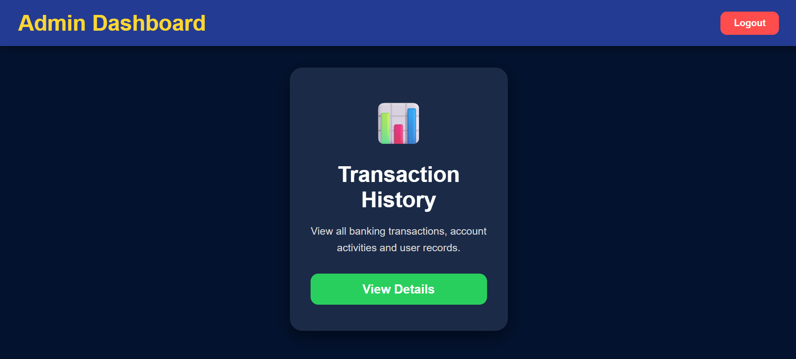
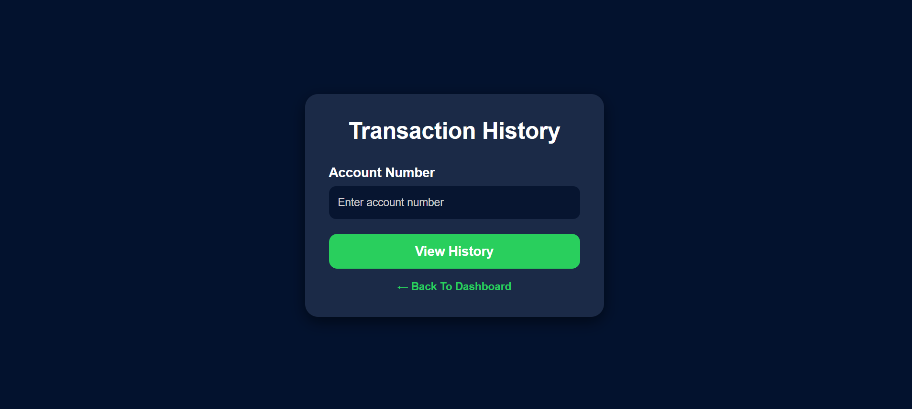
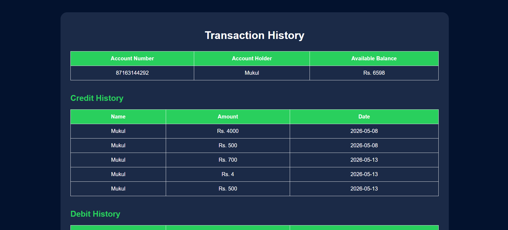

# Banking Management System

A Java Servlet + JDBC based Banking Management System developed using Oracle XE and WebLogic Server.

This project allows users to perform banking operations such as account creation, credit/debit transactions, money transfer, balance checking, transaction history tracking, and admin account monitoring through a web interface.

---

# Features

## User Features

* User Registration & Login
* Create Bank Account
* Credit Money
* Debit Money
* Transfer Money
* Check Balance
* Transaction History
* Change Password
* Logout Functionality

## Admin Features

* View All User Accounts
* Monitor Customer Records
* Access Banking Details

---

# Tech Stack

* Java
* Servlet
* JDBC
* Oracle XE
* WebLogic Server
* HTML
* CSS

---

# Project Structure

```text
banking-management-system
│
├── WEB-INF
│   ├── web.xml
│   └── classes
│
├── *.java
├── *.html
├── database.sql
├── mybatch.bat
├── .gitignore
└── README.md
```

---

# Requirements

Before running the project make sure the following are installed:

* Java JDK
* Oracle XE Database
* WebLogic Server
* servlet-api.jar
* Oracle JDBC Driver (ojdbc jar)

---

# Database Setup

## Step 1

Install Oracle XE.

## Step 2

Open SQL Command Line or SQL Developer.

## Step 3

Run the `database.sql` file.

This file creates required tables:

* employee
* accountdata
* credit
* debit
* transaction

---

# Configure Database Connection

Open:

```text
DBConnection.java
```

Update database username and password according to your Oracle XE setup:

```java
Connection con = DriverManager.getConnection
(
    "jdbc:oracle:thin:@localhost:1521:xe",
    "YOUR_USERNAME",
    "YOUR_PASSWORD"
);
```

---

# Compile Java Files

## Step 1

Open Command Prompt inside the project folder.

## Step 2

Run batch file:

```bash
mybatch.bat
```

This batch file sets required classpath and environment variables.

> Update paths inside `mybatch.bat` according to your system configuration.

## Step 3

Compile Java files:

```bash
javac -d WEB-INF\classes *.java
```

Compiled `.class` files will be generated inside:

```text
WEB-INF/classes
```

---

# Run the Project

## Step 1

Start WebLogic Server.

## Step 2

Deploy the project folder in WebLogic Server.

## Step 3

Open browser and run:

```text
http://localhost:7001/banking-management-system/login
```

---

# Screenshots

## Login Page


## User Dashboard


## Admin Dashboard


## Transaction History


## Transaction History Result


## Transfer Money


## Transfer Money Result


---

# Notes

* Oracle XE service must be running.
* WebLogic Server should be active before deployment.
* Project context path:

```text
/banking-management-system
```

---

# Author

Mukul Dixit

---

# Future Improvements

* Better exception handling
* Password encryption
* Session security improvements
* Responsive UI
* Maven support
* Spring Boot migration

---

# License

This project is developed for learning and educational purposes.
